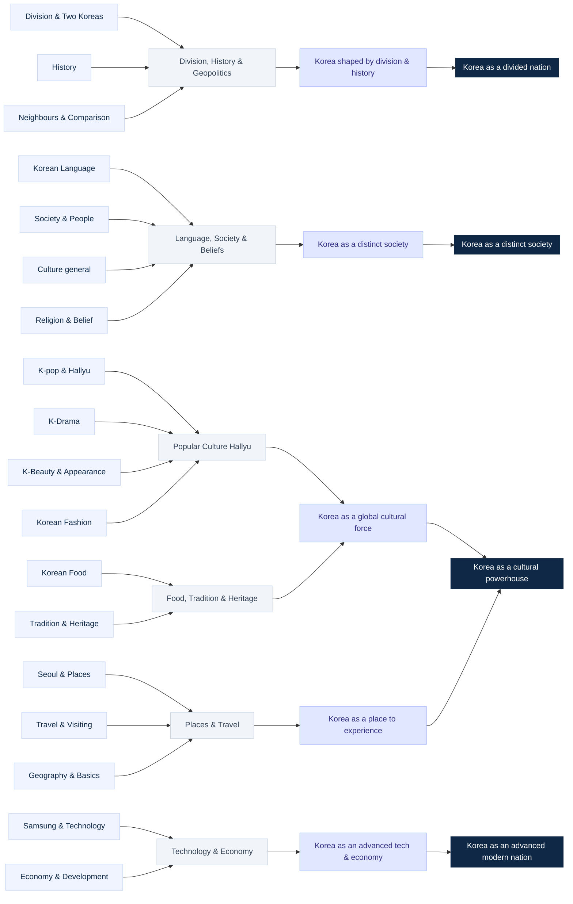

# Ask About Korea — First Real Ontology Proposal

**Generated from:** `collect/output/canonical_questions.json` (live run, 2026-07-15)
**Source:** Google Autocomplete across US, DE, IN, ID, JP, BR, AE, KR · **1,138 canonical questions**
**Method:** concepts discovered by transparent keyword clustering (anchors from the observed top tokens); themes / narratives / perceptions are the interpretive layers.
**Machine-readable:** [`ontology_layer.json`](./ontology_layer.json)

> This is the **first ontology built from real collected data**, not sample data.

## Read this first — data-quality caveats

These shape how much weight each layer can bear:

1. **Autocomplete-only run** (People Also Ask was skipped — no SerpApi key). So 941 of 1,138 items are **topic/entity phrases** ("samsung s26", "kimchi jjigae", "seoul tower"), not "why/how" questions. The ontology is therefore **entity-led**; adding PAA later will add interrogative demand.
2. **Encoding defect** from the Windows collection: **249 items are corrupted** (accented characters became `�`), and this swept most **Korean and Arabic** text into the "gibberish" quarantine — only **13 canonical each** survived for KR and AE. **This first ontology under-represents the KR and AE markets.** Re-running with UTF-8 output will fix this.
3. **Japanese is under-clustered** (115 of the 327 "unclustered"): the MVP clusterer uses Latin/English anchors, so Japanese-script items don't match a concept yet. Cross-language concept alignment (translation) is the deferred next step.
4. **~29% unclustered overall** — bare entities ("south korea") and long-tail attribute questions plus the Japanese items above.

With that stated, the structure below is a faithful, auditable reading of what the eight markets actually searched.

---

## 1. Concept inventory (19)

Concepts are **discovered from the data**. Counts are canonical questions; markets show where they surfaced most.

| # | Concept | Questions | Share | Top markets | Example questions |
|---|---|---|---|---|---|
| 1 | **Division & Two Koreas** | 105 | 9.2% | IN US BR DE ID | *north korea vs south korea*, *korea is south or north*, *korean war*, *kenapa korea wajib militer* |
| 2 | **Korean Food** | 100 | 8.8% | IN US DE ID BR | *kimchi*, *kimchi jjigae*, *kimchi fried rice*, *korean bbq* |
| 3 | **Neighbours & Comparison** | 77 | 6.8% | IN US ID DE JP | *korea vs japan*, *korea vs japan travel*, *korea vs china* |
| 4 | **Travel & Visiting** | 71 | 6.2% | IN US ID BR | *is korea expensive*, *is korea safe*, *is korean tap water safe*, *do you need a visa* |
| 5 | **K-Beauty & Appearance** | 68 | 6.0% | IN US ID BR | *korean skincare*, *korean beauty standards*, *why are koreans so beautiful*, *are koreans tall* |
| 6 | **Korean Language** | 65 | 5.7% | IN US ID DE BR | *how to learn korean*, *is korean hard to learn*, *is korean harder than japanese* |
| 7 | **Culture (general)** | 45 | 4.0% | IN US DE BR ID | *korean culture*, *korean weddings*, *what is korea known for* |
| 8 | **K-pop & Hallyu** | 43 | 3.8% | IN US BR | *k-pop demon hunters*, *why is kpop so popular*, *k-pop* |
| 9 | **Seoul & Places** | 42 | 3.7% | IN US DE BR ID | *seoul tower*, *seoul forest*, *seoul weather* |
| 10 | **Society & People** | 42 | 3.7% | IN US | *korean etiquette*, *korean age calculator*, *korean education system*, *korean names* |
| 11 | **K-Drama** | 35 | 3.1% | IN US ID BR DE | *korean drama*, *korean drama 2026*, *korean drama websites* |
| 12 | **Samsung & Technology** | 34 | 3.0% | IN US BR DE ID | *samsung*, *samsung s26 ultra*, *samsung galaxy* |
| 13 | **History** | 23 | 2.0% | IN US DE ID | *korean history*, *korean history timeline*, *korean history movies* |
| 14 | **Economy & Development** | 17 | 1.5% | IN US | *why is korean won so weak*, *korean economy 2026*, *is korea a developed country* |
| 15 | **Tradition & Heritage** | 15 | 1.3% | IN US ID DE | *hanbok*, *hanbok dress*, *hanbok rental* |
| 16 | **Korean Fashion** | 13 | 1.1% | IN US ID | *korean fashion*, *korean fashion men/women*, *korean fashion brands* |
| 17 | **Religion & Belief** | 10 | 0.9% | IN US DE | *are koreans christian*, *why is korea so christian* |
| 18 | **Geography & Basics** | 6 | 0.5% | IN US DE | *is korea southeast asia*, *why is korea so mountainous*, *south korea population* |
| — | *Unclustered / general* | 327 | 28.7% | JP-heavy | *south korea*, *how do koreans write the date*, *is korea a first world country* |

## 2. Theme inventory (6)

Themes group concepts (sum of member concepts; 811 of 1,138 clustered).

| Theme | Questions | Concepts |
|---|---|---|
| **Division, History & Geopolitics** | 205 | Division · History · Neighbours & Comparison |
| **Language, Society & Beliefs** | 162 | Language · Society & People · Culture · Religion |
| **Popular Culture (Hallyu)** | 159 | K-pop · K-Drama · K-Beauty · Fashion |
| **Places & Travel** | 119 | Seoul & Places · Travel & Visiting · Geography |
| **Food, Tradition & Heritage** | 115 | Korean Food · Tradition & Heritage |
| **Technology & Economy** | 51 | Samsung & Technology · Economy |

## 3. Narrative inventory (5)

Narratives are the interpretive synthesis of themes (human-led).

| Narrative | Questions | From themes |
|---|---|---|
| **Korea as a global cultural force** | 274 | Popular Culture + Food, Tradition & Heritage |
| **Korea as a nation shaped by division & history** | 205 | Division, History & Geopolitics |
| **Korea as a distinct society to understand** | 162 | Language, Society & Beliefs |
| **Korea as a place to experience** | 119 | Places & Travel |
| **Korea as an advanced technology & economy** | 51 | Technology & Economy |

## 4. Perception inventory (4)

Perceptions are where narratives converge — the top layer.

| Perception | Questions | From narratives |
|---|---|---|
| **Korea as a cultural powerhouse** | 393 | global cultural force + place to experience |
| **Korea as a divided nation** | 205 | shaped by division & history |
| **Korea as a distinct society** | 162 | a distinct society to understand |
| **Korea as an advanced modern nation** | 51 | advanced technology & economy |

---

## 5. First ontology graph proposal

`Question → Concept → Theme → Narrative → Perception`. Questions attach to concepts by membership (counts above); the upper structure:

---

## 6. What the real data actually shows (findings)

- **Geopolitics is the single largest theme (205).** The world frames Korea heavily through **comparison and division** — *korea vs japan*, *north korea vs south korea*, *korean war*. Curiosity about Korea is relational, not just intrinsic.
- **"Cultural powerhouse" is the dominant perception (393),** assembled from Hallyu (k-pop, drama, beauty, fashion), food, and travel — the soft-power story, evidenced bottom-up from questions.
- **Samsung is its own concept**, and unusually **even across every market** (US/IN/BR/DE/ID all ~10). Korean *technology as consumer product* is a distinct, global thread.
- **A live pop-culture trend surfaced by itself:** *k-pop demon hunters* is among the highest-salience items — the pipeline caught a current phenomenon, not a preset topic.
- **Market fingerprints differ:** travel practicalities and society questions concentrate in **IN + US**; K-beauty and drama are strong in **ID + BR**; Japan appears mainly as the **comparison** other markets measure Korea against.
- **Religion and appearance** ("is Korea so Christian", "are Koreans tall/beautiful") are small but genuinely emergent concepts we did not pre-define.

## 7. Recommended next steps (data, not design)

1. **Re-run with UTF-8 output** to recover Korean and Arabic (currently ~13 each) and clear the 249 corrupted items — this is the highest-value fix.
2. **Add a SerpApi key and re-run** to layer in People Also Ask, which adds the "why/how" interrogatives this autocomplete-only set lacks.
3. **Cross-language concept alignment** (pivot translation) so Japanese and the other non-English markets attach to concepts — this is what turns per-market inventories into true cross-market comparison.
4. Only after 1–3, consider this ontology stable enough to replace the site's sample data.
