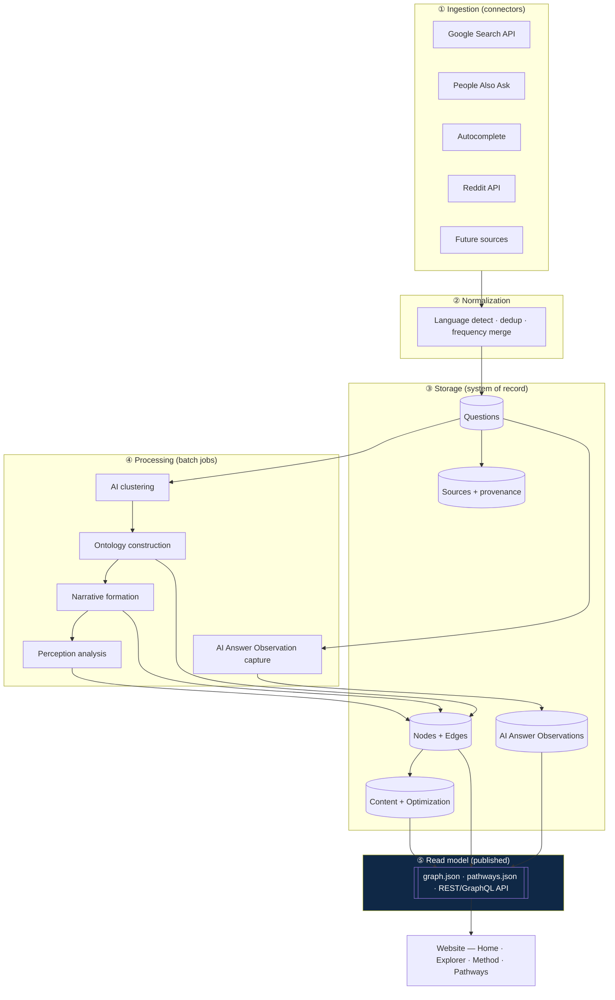
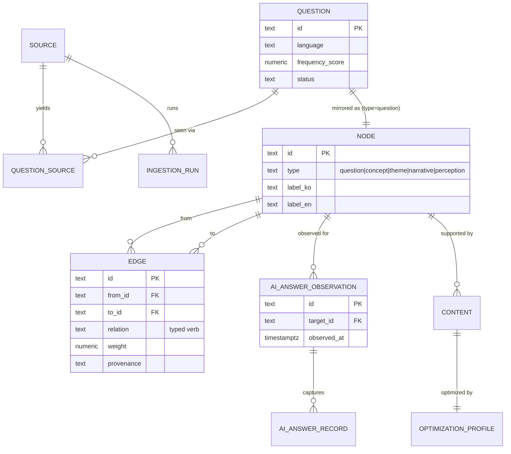
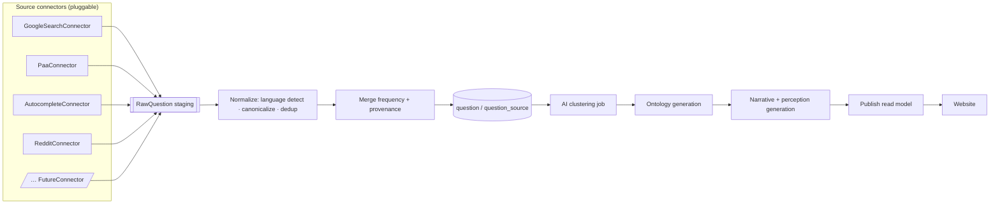
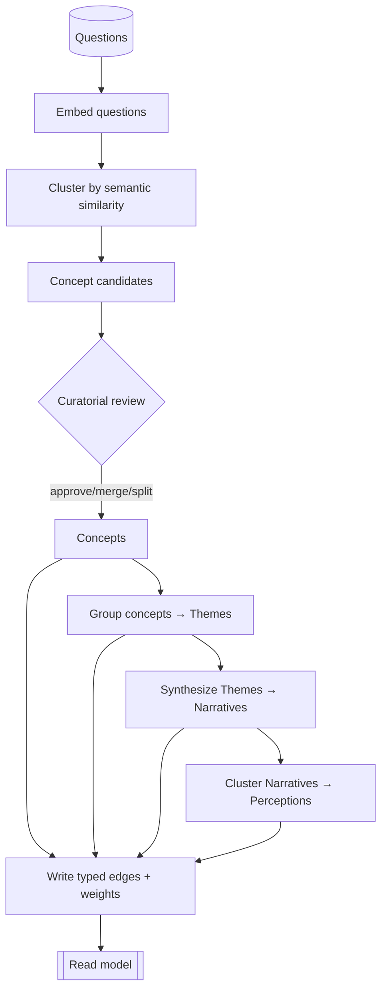
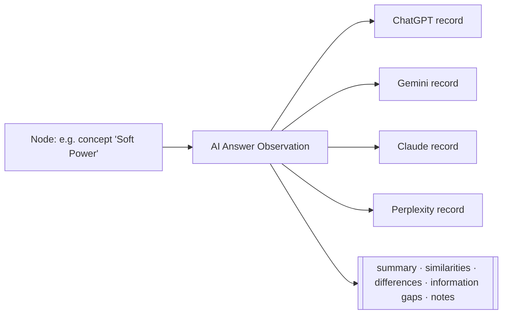
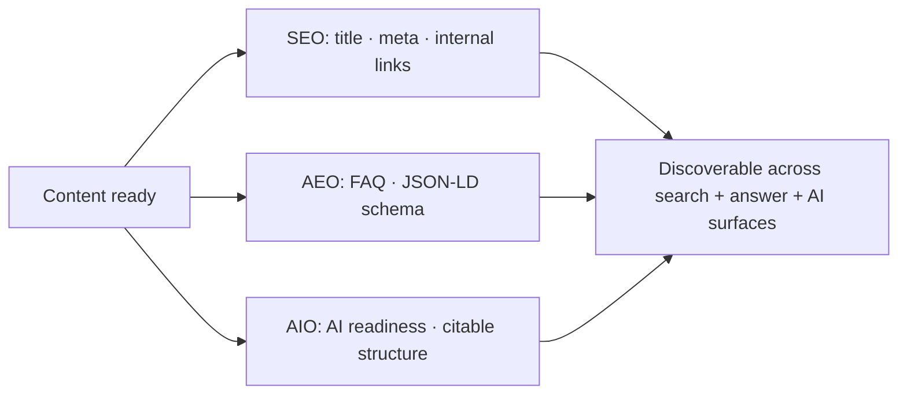

# Ask About Korea — Research Data Architecture

**Status:** Design (pre-implementation) · **Version:** 1.0 · **Scope:** data layer only

Ask About Korea is not a content website. It is a **research platform that studies
how people come to understand Korea** through questions, information, and AI
systems. This document specifies the data architecture that supports that
research — from question collection to perception analysis to publishable,
AI-discoverable content.

The public surfaces (Homepage, Ontology Explorer, Method page, Pathways) are
**unchanged** by this design. They consume a single, stable *read model* (§2.4),
so the entire backend below can be built and later swapped from sample data to
live APIs without touching a single component.

The type definitions referenced throughout live in
[`lib/schema.ts`](../lib/schema.ts). The current sample data
([`lib/ontology.ts`](../lib/ontology.ts)) is a hand-authored projection of the
same read model.

---

## Core framework

Everything is organized around one directional framework — a *perception
pathway*, not a factual chain:

```
Question → Concept → Theme → Narrative → Perception
```

The research process that populates it:

```
Question Collection → Question Mapping → AI Answer Observation →
Ontology Construction → Narrative Formation → Perception Analysis →
Content Creation → SEO / AEO / AIO Optimization → Information Environment Impact
```

Two design commitments shape every table below:

1. **Relationships over classification.** The ontology is a many-to-many graph
   with typed edges. Shared concepts/themes/narratives are first-class — they
   are the point.
2. **Observation, never evaluation.** The AI layer records *what AI systems say*.
   It contains no scoring, grading, or ranking of AI systems (§6).

---

## 1. Research Data Architecture Diagram

Five layers. Data flows down; the website only ever reads the published read
model at the bottom.



**Why this shape:** ingestion, storage, and processing can each scale and change
independently. The website is decoupled from all of it by the read model, which
is the same shape whether it was produced from 30 hand-authored nodes or 10,000
API-collected ones.

---

## 2. Database Schema

DB-agnostic (works on PostgreSQL, or a document store, or flat JSON at small
scale). PostgreSQL is the reference target. Full types: [`lib/schema.ts`](../lib/schema.ts).

### 2.1 Entities at a glance

| Table | Purpose | Part |
|---|---|---|
| `source` | registry of collection platforms | 6 |
| `question` | a collected public question + demand signal | 1 |
| `question_source` | provenance: where/when/how often a question appeared | 6 |
| `node` | unified ontology node (question/concept/theme/narrative/perception) | 3 |
| `edge` | typed, weighted, many-to-many relationship | 3 |
| `ai_answer_observation` | dated observation of how AIs explain a node | 2 |
| `ai_answer_record` | one provider's captured answer within an observation | 2 |
| `content` | evidence-based resource attached to a node | 4 |
| `optimization_profile` | SEO/AEO/AIO workflow state for content | 5 |
| `ingestion_run` | audit record for each collection job | 7 |

### 2.2 Reference DDL (PostgreSQL, abbreviated)

```sql
-- PART 6 · Sources
CREATE TABLE source (
  id            text PRIMARY KEY,
  name          text NOT NULL,
  platform      text NOT NULL,          -- google_search | google_paa | ...
  type          text NOT NULL,          -- search | autocomplete | forum | ...
  active        boolean NOT NULL DEFAULT true,
  created_at    timestamptz NOT NULL DEFAULT now()
);

-- PART 1 · Questions
CREATE TABLE question (
  id              text PRIMARY KEY,
  text_ko         text,
  text_en         text,
  language        text NOT NULL,         -- ko | en
  region          text,                  -- ISO-3166, nullable
  category_id     text,
  primary_source  text NOT NULL REFERENCES source(platform),
  source_type     text NOT NULL,
  collected_at    timestamptz NOT NULL,
  frequency_score numeric(5,4) NOT NULL DEFAULT 0,   -- 0..1
  status          text NOT NULL DEFAULT 'new',       -- new|mapped|observed|published|archived
  created_at      timestamptz NOT NULL DEFAULT now(),
  updated_at      timestamptz NOT NULL DEFAULT now()
);
CREATE INDEX ON question (status);
CREATE INDEX ON question (frequency_score DESC);
CREATE INDEX ON question (language, region);

-- PART 6 · Question ↔ Source provenance (many-to-many, per collection window)
CREATE TABLE question_source (
  id              text PRIMARY KEY,
  question_id     text NOT NULL REFERENCES question(id) ON DELETE CASCADE,
  source_id       text NOT NULL REFERENCES source(id),
  collected_at    timestamptz NOT NULL,
  frequency       integer NOT NULL DEFAULT 1,
  question_origin text NOT NULL,          -- raw query / thread title
  source_url      text
);
CREATE INDEX ON question_source (question_id);
CREATE INDEX ON question_source (source_id, collected_at);

-- PART 3 · Ontology nodes (unified) + typed edges (the relationship spine)
CREATE TABLE node (
  id          text PRIMARY KEY,
  type        text NOT NULL,             -- question|concept|theme|narrative|perception
  label_ko    text NOT NULL,
  label_en    text NOT NULL,
  blurb_ko    text,
  blurb_en    text,
  created_at  timestamptz NOT NULL DEFAULT now(),
  updated_at  timestamptz NOT NULL DEFAULT now()
);
CREATE INDEX ON node (type);

CREATE TABLE edge (
  id          text PRIMARY KEY,
  from_id     text NOT NULL REFERENCES node(id) ON DELETE CASCADE,
  to_id       text NOT NULL REFERENCES node(id) ON DELETE CASCADE,
  relation    text NOT NULL,             -- explained_by | instrument_of | converges_on | ...
  weight      numeric(5,4) NOT NULL DEFAULT 1,
  provenance  text NOT NULL DEFAULT 'manual', -- manual|co_occurrence|ai_cluster|imported
  created_at  timestamptz NOT NULL DEFAULT now(),
  updated_at  timestamptz NOT NULL DEFAULT now(),
  UNIQUE (from_id, to_id, relation)
);
CREATE INDEX ON edge (from_id);
CREATE INDEX ON edge (to_id);

-- PART 2 · AI Answer Observation (observation, not evaluation)
CREATE TABLE ai_answer_observation (
  id            text PRIMARY KEY,
  target_id     text NOT NULL REFERENCES node(id) ON DELETE CASCADE,
  target_type   text NOT NULL,
  observed_at   timestamptz NOT NULL,
  summary_ko    text, summary_en text,
  similarities  jsonb NOT NULL DEFAULT '[]',   -- Localized[]
  differences   jsonb NOT NULL DEFAULT '[]',
  gaps          jsonb NOT NULL DEFAULT '[]',
  notes_ko      text, notes_en text
);
CREATE INDEX ON ai_answer_observation (target_id, observed_at DESC);

CREATE TABLE ai_answer_record (
  id             text PRIMARY KEY,
  observation_id text NOT NULL REFERENCES ai_answer_observation(id) ON DELETE CASCADE,
  provider       text NOT NULL,           -- chatgpt|gemini|claude|perplexity|...
  captured_at    timestamptz NOT NULL,
  model_version  text,                    -- descriptive only
  answer_ko      text, answer_en text,    -- neutral paraphrase, NEVER a score
  notes_ko       text, notes_en text
);
-- NOTE: no score/grade/rank column exists by design.

-- PART 4 · Content
CREATE TABLE content (
  id                          text PRIMARY KEY,
  node_id                     text NOT NULL REFERENCES node(id) ON DELETE CASCADE,
  node_type                   text NOT NULL,
  content_status              text NOT NULL DEFAULT 'not_started',
  article_status             text NOT NULL DEFAULT 'not_started',
  source_verification_status  text NOT NULL DEFAULT 'unverified',
  publication_status          text NOT NULL DEFAULT 'unpublished',
  last_updated                timestamptz NOT NULL DEFAULT now(),
  body_ko text, body_en text,
  related_source_ids          jsonb NOT NULL DEFAULT '[]',
  related_media               jsonb NOT NULL DEFAULT '[]'
);

-- PART 5 · SEO / AEO / AIO
CREATE TABLE optimization_profile (
  id                       text PRIMARY KEY,
  content_id               text NOT NULL REFERENCES content(id) ON DELETE CASCADE,
  seo_status               text NOT NULL DEFAULT 'not_started',
  aeo_status               text NOT NULL DEFAULT 'not_started',
  aio_status               text NOT NULL DEFAULT 'not_started',
  title_ko text, title_en text,
  meta_description_ko text, meta_description_en text,
  faq_status               text NOT NULL DEFAULT 'not_started',
  schema_status            text NOT NULL DEFAULT 'not_started',
  internal_linking_status  text NOT NULL DEFAULT 'not_started',
  ai_readiness_status      text NOT NULL DEFAULT 'not_started',
  updated_at               timestamptz NOT NULL DEFAULT now()
);
```

### 2.3 Status vocabularies

| Field group | Values |
|---|---|
| `question.status` | `new → mapped → observed → published → archived` |
| content workflow | `not_started → drafting → in_review → ready → needs_update` |
| source verification | `unverified → in_progress → verified` |
| publication | `unpublished → scheduled → published` |
| SEO/AEO/AIO | `not_started → in_progress → complete` |

### 2.4 The read model (frontend contract)

A publish job flattens the tables into `graph.json` + `pathways.json` (or an
equivalent API) shaped exactly like today's `buildGraph()` output:

```ts
GraphReadModel = {
  generatedAt: ISODate,
  nodes: { id, type, label, blurb?, evidence? }[],
  edges: { from, to, relation?, weight? }[],
  pathways: { id, title, themeLabel, steps }[]
}
```

**This is the only shape the website knows about.** Swapping sample → live data
means regenerating this file; no component changes.

---

## 3. Entity Relationship Diagram (ERD)



### Cardinalities (Part 3 requirements)

| Relationship | Cardinality | How it's modeled |
|---|---|---|
| Question ↔ Concept | many-to-many | `edge` rows (question→concept) |
| Concept ↔ Question | many-to-many | same `edge` table, reverse traversal |
| Theme ↔ Concept | many-to-many | `edge` (concept→theme) |
| Narrative ← Themes | many-to-many | `edge` (theme→narrative) |
| Perception ← Narratives | many-to-many | `edge` (narrative→perception) |

Because relationships live in one generic `edge` table, a *shared* node (e.g.
`Soft Power`, reached from both the K-pop and Hangul questions) is simply a node
with multiple inbound edges — no special case, no structural change.

---

## 4. API Ingestion Architecture



### The connector contract (why no redesign is ever needed)

Every source implements one interface (`SourceConnector` in `lib/schema.ts`):

```ts
interface SourceConnector {
  platform: SourcePlatform;
  collect(params): Promise<RawQuestion[]>;
}
```

- **Adding a new API** (e.g. YouTube search, Naver, X) = write one connector that
  returns `RawQuestion[]`, register it. Normalization, storage, ontology
  generation, and the website are untouched.
- **`RawQuestion`** carries the untouched `raw` payload for audit, so a source's
  quirks never leak into the core schema.
- **Normalization is the single choke point**: language detection, canonical
  text, dedup, and frequency merge all happen once, so every downstream table is
  source-agnostic.
- **`ingestion_run`** records each job (raw/normalized/upserted counts) for
  reproducibility.

Sample → live migration path: today the read model is authored by hand; tomorrow
it is emitted by `PUB`. The switch is a config flag, not a rewrite.

---

## 5. Ontology Generation Flow



- **Clustering proposes; curation disposes.** AI clustering generates *candidate*
  concepts and edges (`provenance = ai_cluster`); a reviewer approves, merges, or
  splits them (`provenance = manual`). Provenance is retained so the graph can be
  filtered by "AI-proposed vs. human-verified."
- **Edge weight** = normalized co-occurrence / cluster confidence, used for edge
  thickness and highlight ordering in the Explorer.
- **Perceptions** are the top layer: clusters of narratives that recur across many
  questions. This is where "how the world understands Korea" becomes measurable.

---

## 6. AI Answer Observation Structure

> The platform **observes** AI-generated answers. It does **not** evaluate, score,
> or rank AI systems. There are no score/grade/rank fields anywhere in the model.



One `ai_answer_observation` per node per date, each holding N
`ai_answer_record`s (one per provider). Captured fields:

| Field | Meaning |
|---|---|
| `answerSummary` (per provider) | neutral paraphrase of what that system said |
| `summary` | cross-provider synthesis |
| `observedSimilarities` | where providers align |
| `observedDifferences` | where they diverge |
| `observedInformationGaps` | what appears thin or missing in the current answers |
| `notes` | researcher context |

The information-gap field is what feeds Content Creation (§ Part 4): observed
gaps become the brief for evidence-based resources.

---

## 7. SEO / AEO / AIO Structure

Each published `content` row has exactly one `optimization_profile` tracking its
readiness across three discovery surfaces:

| Layer | Question it answers | Key fields |
|---|---|---|
| **SEO** | Can classic search find it? | `seoStatus`, `title`, `metaDescription`, `internalLinkingStatus` |
| **AEO** (Answer Engine) | Can answer boxes / featured snippets use it? | `aeoStatus`, `faqStatus`, `schemaStatus` |
| **AIO** (AI Information) | Can generative AI cite it cleanly? | `aioStatus`, `aiReadinessStatus` |



Every status uses the same `not_started → in_progress → complete` vocabulary, so
a single dashboard query can report readiness across the whole corpus.

---

## 8. Future Expansion Plan

### Scalability (Part 8) — one structure, 30 → 10,000+ nodes

The schema **does not change** with volume; only operational choices do.

| Scale | Storage | Graph read model | Notes |
|---|---|---|---|
| ~1,000 questions | Postgres (or SQLite/JSON) | generated on publish | single instance; indexes in §2.2 suffice |
| ~5,000 | Postgres | **materialized view** refreshed on publish | add embedding index for clustering |
| 10,000+ | Postgres (+ partition `question_source` by month) | precomputed `graph.json` served from CDN | clustering runs as scheduled batch |

Why it holds: the website reads a **precomputed read model**, so render cost is
constant regardless of database size. Relationships live in one indexed `edge`
table; adding nodes adds rows, never columns or joins-of-joins. Ingestion is
append-only staging + idempotent upsert, so re-runs and back-fills are safe.

### Expansion axes (no redesign required)

- **New source** → new `SourceConnector` (§4).
- **New AI provider** → new `ai_answer_record.provider` literal; observation
  structure unchanged (§6).
- **New relationship kind** → new `relation` verb string; `edge` table unchanged.
- **New ontology layer** → new `node.type` value; edges already generic.
- **New language** → `Localized` is `{ ko, en }` today; widen to a map
  (`Record<Locale, string>`) when a third language is added — a type change, not
  a schema redesign.
- **New country/region** → `question.region` already present; the same framework
  ("how does the world understand X?") applies to any subject.

### Phasing

1. **Phase 1 (now):** hand-authored read model, sample data, full public site.
2. **Phase 2:** stand up Postgres with this schema; import current sample data;
   add the read-model publish job (frontend unchanged).
3. **Phase 3:** implement connectors (Google, PAA, Autocomplete, Reddit) →
   normalization → live `question` collection.
4. **Phase 4:** clustering + ontology/narrative generation jobs; provenance-based
   review UI.
5. **Phase 5:** AI Answer Observation capture cadence; Content + SEO/AEO/AIO
   workflow tooling; perception analysis dashboards.

---

## Appendix · Mapping to the current codebase

| Design entity | Current sample equivalent |
|---|---|
| `node` (+ `question`) | `NODES` in `lib/ontology.ts` |
| `edge` | `GRAPH_EDGES` in `lib/ontology.ts` |
| `question_source` / `Evidence` | `evidence[]` on each node |
| `GraphReadModel` | `buildGraph()` output |
| `PathwayReadModel` | `PATHWAYS` |

The running site already consumes only the read-model shape, which is why this
architecture can be implemented entirely behind it.
