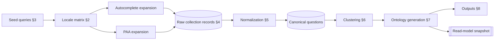
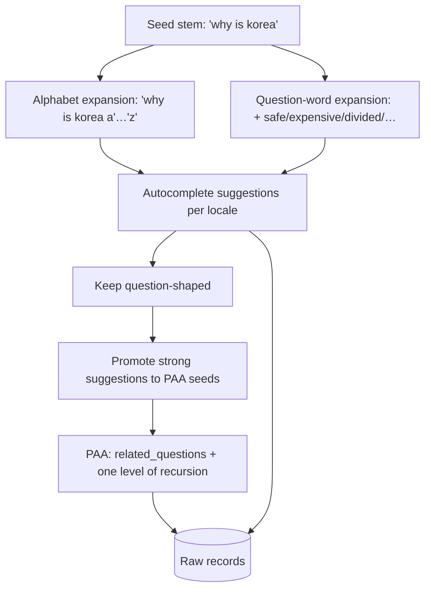
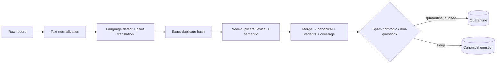
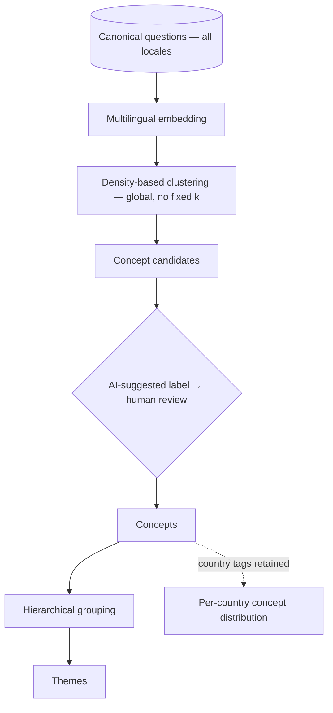
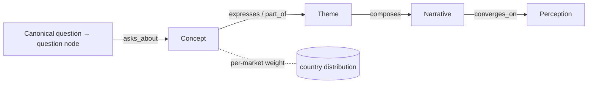

# Ask About Korea — MVP Question Collection System

**Status:** Research implementation plan (pre-build) · **Version:** 1.0
**Builds on:** [`QUESTION-COLLECTION-FRAMEWORK.md`](./QUESTION-COLLECTION-FRAMEWORK.md),
[`PILOT-STUDY-KPOP.md`](./PILOT-STUDY-KPOP.md), [`ARCHITECTURE.md`](./ARCHITECTURE.md),
[`../lib/schema.ts`](../lib/schema.ts)

This document specifies the minimum viable system for collecting **real** questions
about Korea. It is an implementation plan, not code: no connectors, no APIs, and no
website changes are introduced here. It translates the validated methodology into a
concrete, low-cost, fast collection procedure and the working dataset that results.

## Objectives

The collection is instrumental, not an end in itself. It exists to answer:

- What questions are most commonly asked about Korea?
- How does curiosity differ **by country/region**?
- Which concepts recur across questions and markets?
- How do those concepts contribute to perceptions of Korea?

The outputs feed, in order, question discovery → ontology generation → narrative
formation → perception analysis → content → discovery workflows.

## Design posture

Per the [feasibility study](./QUESTION-COLLECTION-FRAMEWORK.md), the MVP uses the
two frictionless, near-zero-cost sources as **primary**, and defers the third:

| Priority | Source | Access in MVP | Cost |
|---|---|---|---|
| Primary | **Google Autocomplete** | unofficial suggestions endpoint (localizable) | $0 |
| Primary | **Google People Also Ask** | SERP API free tier (SerpApi 250/mo) | $0 |
| Secondary (later) | Reddit | official OAuth / Reddit-for-Researchers, applied for in parallel | $0 (once approved) |

The whole first-1,000 effort is designed to run at **≈ $0** and to prioritize
**speed, research value, and data quality over engineering complexity.** The MVP is
deliberately a lightweight collection procedure over a flat working dataset — not a
service — that maps cleanly onto the normalized model in `lib/schema.ts` when the
platform later industrializes it.

---

## 1. MVP Collection Strategy

The MVP is a repeatable, mostly-manual loop, run per collection cycle:



Principles:

- **One dataset, three granularities** — raw records → canonical questions →
  ontology nodes. Country/region lives on the *raw record* and is aggregated
  upward; it is never discarded.
- **Human-in-the-loop from the start** — collection and normalization are
  semi-automated; concept/theme/narrative/perception assignments are reviewed
  (the AI-suggested → human-verified states from the framework).
- **Snapshot each cycle** — every cycle ends in a versioned dataset snapshot so
  distribution and growth can be compared over time.

---

## 2. Country-Level Collection Strategy

Country/region is a first-class dimension. It is collected **honestly**: we do not
and cannot observe who asks. We observe **the question surface served to each
locale**, by setting localization parameters. The country signal is therefore a
*market/locale conditioning of the results*, not per-person geodata.

### 2.1 What is realistically collectable

| Collectable | Not collectable |
|---|---|
| The set of autocomplete suggestions served to a given `country + language` | The individual asker's country, age, or gender |
| The PAA questions served for a query in a given locale | True per-country query volumes |
| The relative *ordering* of suggestions within a locale | Precise demographic attribution |

> **Explicitly excluded: age and gender.** They are not realistically available
> and are out of scope. The three dimensions we retain are **Country/Region,
> Language, and Source Platform.**

### 2.2 Launch locales

English-first, because these markets share a language yet differ in curiosity —
ideal for comparison. Korea (KO) is included as a *domestic reference* baseline.

| Region | `gl` | `hl` (primary) | Notes |
|---|---|---|---|
| United States | us | en | largest English market |
| United Kingdom | uk / gb | en | |
| Canada | ca | en | (fr optional, later) |
| Australia | au | en | |
| India | in | en | (hi optional, later) |
| Singapore | sg | en | multilingual hub |
| Korea (reference) | kr | ko | domestic baseline for contrast |

Future expansion is additive: a new region is one more row in this matrix and one
more value in the `country_region` field — no structural change.

### 2.3 How localization parameters are used

- **Autocomplete:** the suggestions endpoint accepts `gl` (country) and `hl`
  (language). The same seed is run once per locale row.
- **PAA (SERP API):** set the provider's `location` / `gl` and `hl` / `language`
  parameters per locale.
- **Language vs. Region are independent axes.** For these launch locales language
  is mostly English; India and Singapore can later add a second language, and the
  KO reference uses Korean. Keeping language separate from region is what lets us
  ask "same question, different market" and "same market, different language."

### 2.4 Country comparisons this enables

- **Coverage differences** — questions/concepts present in one locale but absent in
  another.
- **Emphasis differences** — the relative prominence (ordinal rank / recurrence) of
  a concept across locales.
- **Phrasing differences** — how the same underlying need is worded per market.
- **Shared core vs. local tail** — the questions common to all locales vs. those
  specific to one.

All comparisons are **relative/ordinal**, never absolute counts — a constraint the
sources impose and we state plainly.

---

## 3. Seed Query Strategy

Collection begins from a small, curated **seed set**, expanded mechanically. Seeds
are question stems and topic anchors — never predefined categories.

### 3.1 Seed families

| Family | Purpose | Examples |
|---|---|---|
| **Question-word stems** | capture directed curiosity | `why is korea`, `why do koreans`, `what is korea`, `how korea`, `is korea`, `is korean` |
| **Topic anchors** | probe specific domains without assuming categories | `korean culture`, `korean food`, `k-pop`, `korean language`, `korean history` |
| **Comparative stems** | surface relational curiosity | `korea vs`, `korean vs`, `is korea better than` |
| **Attribute stems** | surface trait-level curiosity | `koreans are`, `korea is so`, `why is korea so` |
| **Korean-language stems** (KO locale) | domestic baseline | `한국은 왜`, `한국인은 왜`, `케이팝 왜`, `한국 ` |

A launch seed set of **~40–60 stems** is sufficient; it grows as gaps appear.

### 3.2 How expansion works



- **Autocomplete expansion.** Each seed is suffixed with a–z and with common
  continuations, run **per locale**, and the returned suggestions are collected.
  Suggestions that are question-shaped (or trivially rewritable to a question) are
  kept; the rest inform later seeds.
- **PAA expansion.** The strongest suggestions become PAA seed queries. The
  `related_questions` returned are collected, then expanded **one level** (each PAA
  question re-queried once). Recursion is capped at one level in the MVP to control
  cost and drift.
- **Multilingual expansion.** The KO reference locale runs Korean seeds; India and
  Singapore can later add a local-language pass. Cross-lingual questions are unified
  downstream by translation-assisted matching (§5), not by collecting them
  separately.

Seed expansion is **generative but bounded**: a fixed seed set × locales × one PAA
recursion yields hundreds of candidates deterministically, without unbounded
crawling.

---

## 4. Question Dataset Structure

The MVP working dataset is a flat table (spreadsheet / JSON / CSV) — deliberately
simple. It carries the required fields and maps 1:1 to `Question` /
`QuestionSource` in [`lib/schema.ts`](../lib/schema.ts). Ontology fields are
**nullable at collection** and filled during processing.

| Field | Filled at | Description |
|---|---|---|
| `question_id` | collection | stable id |
| `question_text` | collection | original text (+ language) |
| `source_platform` | collection | `autocomplete` \| `paa` \| `reddit` |
| `country_region` | collection | `US`\|`UK`\|`CA`\|`AU`\|`IN`\|`SG`\|`KR`\|… |
| `language` | collection | `en`\|`ko`\|… |
| `collection_date` | collection | ISO date |
| `frequency_indicator` | collection→aggregated | relative salience (see below) |
| `collection_method` | collection | e.g. `autocomplete:seed='why is korea':exp=alpha:gl=us` |
| `concept` | clustering | nullable until assigned |
| `theme` | clustering | nullable |
| `narrative` | analysis | nullable |
| `perception` | analysis | nullable |
| `status` | lifecycle | `raw → normalized → canonical → clustered → mapped` |
| `canonical_id` | normalization | links variants to their canonical question |
| `provenance` | collection | seed, locale params, PAA source URL, raw payload |

**Frequency indicator (relative).** No source gives true volume. The MVP composes a
relative salience from signals we *do* have:

```
salience ≈ f( #locales surfacing it, #sources, autocomplete rank, PAA recurrence )
```

Recorded per raw record (e.g. autocomplete rank), then aggregated to the canonical
question as breadth across locales and sources. It is always presented as relative,
never as a count.

**Three granularities (one dataset):**

- *Raw record* — one row per observed question, per locale, per source. Holds
  `country_region`, `language`, `source_platform`, rank.
- *Canonical question* — variants merged (§5); holds the set of locales/sources it
  appeared in.
- *Ontology node* — reviewed cluster (§6–7); holds concept/theme/narrative/perception.

Country/region therefore aggregates naturally: a canonical question records *which
markets surfaced it*, and a concept records *its distribution across markets*.

---

## 5. Normalization Workflow

Normalization reduces surface forms to **canonical questions**, each with variants,
locale/source coverage, and merged salience. It is distinct from clustering (§6):
normalization merges *paraphrases of one need*; clustering groups *different needs*.



1. **Text normalization** — Unicode/spacing/case/punctuation; keep the raw text.
2. **Language normalization** — detect language; keep original + attach an English
   pivot translation *for comparison only*. Non-English questions are never
   discarded.
3. **Exact-duplicate detection** — hash of normalized text; identical strings merge.
   This is common across locales (the same suggestion surfaces in US and UK) — and
   the merge **records both locales**, which is exactly the coverage signal we want.
4. **Near-duplicate merging** — lexical (token/edit distance) plus semantic
   (embedding similarity) to merge paraphrases into one canonical, summing salience
   and unioning coverage.
5. **Spam / off-topic filtering** — remove commercial, gibberish, non-question, and
   not-about-Korea items to an audited quarantine, never deleting.

**Worked merge.** "Why is Kimchi famous?", "What makes Kimchi famous?", and "Why do
people like Kimchi?" share few words but one underlying need. Exact matching fails;
semantic similarity is high, so they **merge into one canonical question** with three
recorded variants. If they arrived from US-autocomplete, UK-PAA, and Reddit
respectively, the canonical records **coverage = {US, UK} × {autocomplete, PAA, …}**
— demonstrating cross-source and cross-market strength in a single row.

---

## 6. Clustering Workflow

Clustering groups **canonical questions** into concepts, then concepts into themes —
emergent, no supplied categories. The key MVP decision for country analysis:
**cluster once on the pooled multilingual set; keep country as an attribute.**



- **Concepts emerge** from dense regions of the embedding space; each is labeled by
  its representative questions + key terms, AI-suggested then human-reviewed.
- **Themes emerge** from grouping concepts (a coarser clustering), also reviewed.
- **Narratives emerge** by human-led synthesis of themes (AI-assisted); **perceptions**
  by clustering recurring narratives. These interpretive layers stay human-verified.
- **Country-specific differences are preserved without fragmenting the graph.** We do
  **not** cluster each country separately (that would splinter shared structure).
  We cluster globally and retain each question's `country_region`, so *after*
  clustering we compute, for every concept/theme, its **distribution across
  markets**. Divergence becomes measurable metadata on shared nodes — e.g. a
  *DMZ / security* concept weighted toward some markets, a *K-pop / fandom* concept
  toward others — while the ontology itself stays unified.

---

## 7. Ontology Generation Workflow

Reviewed clusters are promoted into typed nodes and edges, staged from computational
to interpretive (as in the framework). Country attributes ride along as edge/node
metadata.



**Shared, bridging, and cross-category concepts** are the point of the exercise and
arise naturally when a concept is reached from multiple question clusters and/or
multiple markets:

| Concept | Why it bridges |
|---|---|
| **Soft Power** | reached from K-pop, language, and food questions across markets |
| **National Identity** | reached from language, tradition, and achievement questions |
| **Community Culture** | reached from food and etiquette questions |
| **Historical Memory** | reached from division, war, and DMZ questions |

Promotion rules:

- Canonical question → `question` node; variants + sources + locales become its
  evidence.
- Reviewed concept cluster → `concept` node; membership → `question → concept` edges
  with weight and **per-market distribution**.
- Concepts → themes → narratives → perceptions, each edge carrying review status and
  provenance (`ai_suggested → human_verified`).

The result is the same `node`/`edge`/read-model shape the site already renders —
now populated from real, market-tagged data.

---

## 8. Future Outputs

Designed now, produced as the dataset grows; all feed the existing Explorer and
Method surfaces rather than a separate dashboard.

| Output | Shows | Inputs |
|---|---|---|
| **Question Distribution Maps** | relative demand share across concepts | canonical salience by concept |
| **Country Comparison Views** | how concept emphasis differs by market; shared core vs. local tail | per-market concept distribution |
| **Ontology Graphs** | the question→…→perception network | nodes + edges (existing Explorer) |
| **Concept Centrality Analysis** | which concepts bridge the most clusters | edge degree / betweenness |
| **Narrative Analysis** | how narratives assemble from themes, and their market spread | theme→narrative edges + country metadata |
| **Perception Analysis** | which perceptions dominate, and how they differ by market | narrative→perception edges + distribution |

Country comparison is the distinctive research output: a *small-multiples* or
side-by-side view of the same ontology weighted per market, making "how curiosity
about Korea differs across the world" directly legible.

---

## First 100 / 500 / 1,000 Question Roadmap

Each stage is a full cycle (collect → normalize → cluster → review → snapshot).
Yields use the pilot's ≈ 2.2 : 1 dedup ratio; all stages run at ≈ $0.

| Stage | Scope | Locales | Sources | Approx. raw → canonical | Research milestone |
|---|---|---|---|---|---|
| **100** (Day 1) | mechanics validation | US only, EN | Autocomplete + PAA | ~230 raw → ~100 canonical | live collection proven end-to-end; first real concepts |
| **500** (Week 1) | first comparison | US, UK, CA, AU, IN, SG + KO ref | Autocomplete + PAA | ~1,100 raw → ~500 canonical | first **country comparison** + first themes |
| **1,000** (Weeks 2–3) | first full ontology | above + deeper seeds, 1-level PAA recursion; Reddit secondary sample | Autocomplete + PAA (+ Reddit) | ~2,200 raw → ~1,000 canonical | full ontology generation: concepts, themes, narratives, perceptions, centrality, per-market distribution |

**Stage 100 — prove the loop.** One locale, both primary sources, ~40 seeds. The
aim is not breadth but confirming the collect→normalize→cluster loop works on live
data and reproduces sensible concepts.

**Stage 500 — turn on country.** Run the same seeds across all launch locales + KO
reference. This is the first point at which **country comparison** is possible, and
the first themes stabilize.

**Stage 1,000 — first real ontology.** Deepen seeds (topic + comparative families),
allow one level of PAA recursion, and fold in a small approved Reddit sample for
depth. Produce the full ontology and all six output types, tagged by market. This
snapshot becomes the first candidate to replace the site's sample data.

**Parallel track (all stages):** the Reddit OAuth / Reddit-for-Researchers
application runs from Day 1, so its access matures by Stage 1,000 without blocking
the primary sources.

---

## Appendix · Fit with existing work

| This plan defines | Realized by |
|---|---|
| MVP loop, low-cost sourcing | feasibility findings in the docs set |
| Flat collection dataset | `Question` / `QuestionSource` (`lib/schema.ts`) |
| Country/Region/Language/Platform dimensions | fields on the collection record |
| Normalization + clustering | framework §3–4; validated in the pilot |
| Ontology promotion + read model | `ARCHITECTURE.md` §3–5; `buildGraph()` |
| Outputs | the existing Ontology Explorer + Method surfaces |

The MVP collection system is the operational front end of the architecture already
designed: it produces exactly the market-tagged `node`/`edge`/`evidence` data the
platform is built to hold and the website is built to render — no redesign required.
