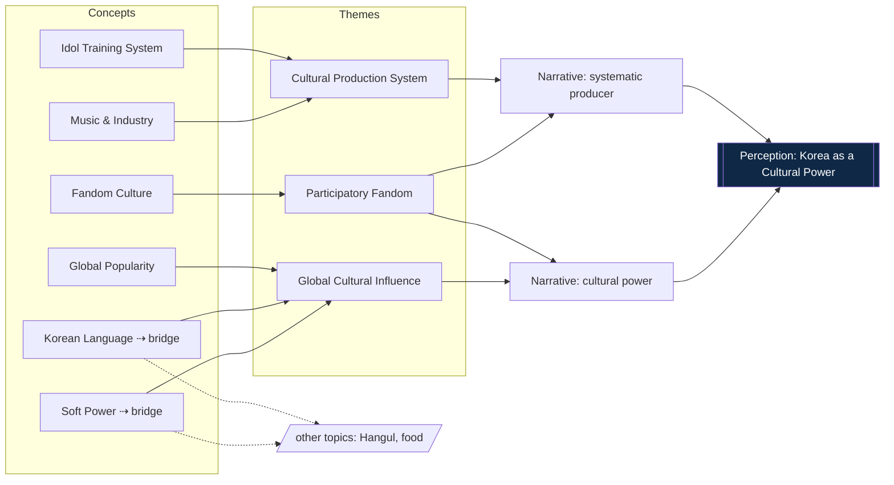

# Pilot Question Discovery Study — Seed Topic: K-pop

**Status:** Methodology validation (pre-implementation) · **Version:** 1.0
**Applies:** [`QUESTION-COLLECTION-FRAMEWORK.md`](./QUESTION-COLLECTION-FRAMEWORK.md)
· **Data model:** [`../lib/schema.ts`](../lib/schema.ts)

## Purpose

This pilot exercises the entire Question Collection Framework by hand, on one
seed topic, to confirm the method produces coherent ontology structure before any
connector or API is built. It walks through seven steps end to end: collection,
normalization, clustering, concept extraction, theme formation, narrative
formation, and perception mapping.

> **All questions below are illustrative sample data**, authored for methodology
> validation. They are realistic in form and intent but are not drawn from live
> APIs. This mirrors the "sample data" stance of the public site.

**Seed topic:** *K-pop.* Chosen because it generates genuine curiosity across all
four sources, in both Korean and English, and is broad enough to fragment into
several distinct concepts — a good stress test of *emergent* clustering.

**Result in one line:** 36 raw questions → 33 in-scope → 15 canonical questions →
**6 concepts → 3 themes → 2 narratives → 1 perception**, with two bridging
concepts identified for cross-topic linking.

---

## Step 0 · Collection design

Seeds used per source (the framework's sources are queried with topic stems, not
category assumptions):

| Source | Seed method | Example stems |
|---|---|---|
| Google Search | directed query capture | `why is kpop popular`, `how to become a kpop idol` |
| People Also Ask | branch from seed SERPs | follow-ups surfaced around the seed |
| Autocomplete | prefix expansion | `why is kpop…`, `kpop idol…`, `learn korean…` |
| Reddit | topic + question search | threads asking about K-pop in English communities |

Korean-language stems (`케이팝…`, `아이돌…`) were run in parallel so demand in both
languages is captured.

---

## Step 1 · Question Collection

Raw records as observed. `Freq` is a **relative** indicator (High/Med/Low), not a
volume count. `Method` records how each was gathered.

**Google Search** (directed intent)

| ID | Question | Lang | Freq |
|---|---|---|---|
| r01 | why is kpop so popular | en | High |
| r02 | how to become a kpop idol | en | High |
| r03 | how long do kpop idols train | en | Med |
| r04 | what is a kpop comeback | en | Med |
| r05 | why do kpop fans buy multiple albums | en | Med |
| r06 | do kpop idols write their own songs | en | Med |
| r07 | why do people learn korean for kpop | en | Med |

**People Also Ask** (algorithmic branching)

| ID | Question | Lang | Freq |
|---|---|---|---|
| r08 | How did K-pop become so popular? | en | High |
| r09 | How much do K-pop idols earn? | en | Med |
| r10 | Is it hard to become a K-pop idol? | en | Med |
| r11 | Why do K-pop fans buy so many albums? | en | Med |
| r12 | Do K-pop idols have dating bans? | en | Med |
| r13 | What is a K-pop fandom? | en | Low |

**Autocomplete** (in-progress phrasings)

| ID | Question / stem | Lang | Freq |
|---|---|---|---|
| r14 | why is kpop … | en | High |
| r15 | how to become a kpop idol | en | High |
| r16 | kpop idol diet | en | Med |
| r17 | kpop lightstick meaning | en | Low |
| r18 | learn korean through kpop | en | Med |
| r19 | kpop trainee life | en | Med |
| r20 | kpop idol dating ban | en | Med |

**Reddit** (natural, contextual)

| ID | Question | Lang | Freq |
|---|---|---|---|
| r21 | Why do fans buy so many copies of the same album? | en | Med |
| r22 | Is the K-pop trainee system exploitative? | en | Med |
| r23 | Did you start learning Korean because of K-pop? | en | Med |
| r24 | How does K-pop change Korea's image abroad? | en | Med |
| r25 | Are idol dating bans actually real? | en | Med |
| r26 | Why is K-pop so popular worldwide? | en | High |
| r27 | What's the deal with comebacks? | en | Low |

**Korean-language items** (parallel collection)

| ID | Question | Lang | Method | Freq |
|---|---|---|---|---|
| r28 | 케이팝은 왜 인기가 많나요? | ko | search | High |
| r29 | 아이돌 연습생은 몇 년 준비하나요? | ko | paa | Med |
| r30 | 케이팝 때문에 한국어 배우는 사람 많나요? | ko | reddit | Med |
| r31 | 응원봉은 왜 사나요? | ko | autocomplete | Low |
| r32 | 아이돌 되는 법 | ko | autocomplete | High |
| r33 | 아이돌 다이어트 식단 | ko | search | Med |

**Flagged at intake** (for the spam/off-topic gate in Step 2)

| ID | Item | Reason |
|---|---|---|
| r34 | buy cheap kpop albums online discount | commercial solicitation |
| r35 | asdfghjkl kpop lol | gibberish, non-question |
| r36 | what is the best pop music genre | off-topic (not Korea-specific) |

**Collected:** 36 raw · 33 in scope · 3 flagged.

---

## Step 2 · Normalization

Text was Unicode/spacing/case normalized; Korean items were kept in the original
and given an English pivot translation for cross-lingual comparison; exact and
near-duplicates were merged into **canonical questions** carrying their variants
and a composite frequency; flagged items were **quarantined, not deleted**.

**Quarantine (audited):** r34 (commercial), r35 (gibberish), r36 (off-topic). →
33 in-scope questions proceed.

**Canonical questions** (variants merged; `Breadth` = number of the four sources
on which the underlying question appeared):

| Canon | Canonical question | Merged from | Breadth | Freq |
|---|---|---|---|---|
| Q01 | Why is K-pop so popular worldwide? | r01, r08, r14, r26, r28 | 4 / 4 | High |
| Q02 | How do you become a K-pop idol? | r02, r15, r32 | 2 | High |
| Q03 | How hard is it to become an idol? | r10 | 1 | Med |
| Q04 | How long do idols train? | r03, r29 | 2 | Med |
| Q05 | What is a comeback? | r04, r27 | 2 | Med |
| Q06 | Why do fans buy multiple copies of an album? | r05, r11, r21 | 3 | Med |
| Q07 | Do idols write their own songs? | r06 | 1 | Med |
| Q08 | Why do people learn Korean because of K-pop? | r07, r18, r23, r30 | 3 | Med |
| Q09 | How much do idols earn? | r09 | 1 | Med |
| Q10 | Do idols have dating bans? | r12, r20, r25 | 3 | Med |
| Q11 | What is a fandom? | r13 | 1 | Low |
| Q12 | What is idol training / diet life like? | r16, r19, r33 | 2 | Med |
| Q13 | Why do fans buy a lightstick? | r17, r31 | 2 | Low |
| Q14 | Is the trainee system exploitative? | r22 | 1 | Med |
| Q15 | How does K-pop affect Korea's global image? | r24 | 1 | Med |

**Worked merge — Q01.** Five surface forms (`why is kpop so popular`, `How did
K-pop become so popular?`, `why is kpop…`, `Why is K-pop so popular worldwide?`,
`케이팝은 왜 인기가 많나요?`) share one information need. Lexical overlap alone is
partial (different words, two languages); semantic similarity is high, so all five
merge into **one** canonical question. Because they arrived from **all four
sources**, Q01 has maximum evidentiary breadth — the strongest signal in the set.

**Dedup ratio:** 33 in-scope → 15 canonical (≈ 2.2 : 1).

> Note the distinction the framework insists on: this step merged *paraphrases of
> one question*. Grouping *different questions* into concepts is the next step.

---

## Step 3 · Clustering

The 15 canonical questions were embedded (multilingual, so KO and EN sit in one
space) and grouped by density — **no category list was supplied**. Six clusters
emerged; each received an AI-suggested label, then a human-reviewed label.

| Cluster | Member canonicals | Size | AI-suggested label | Human-reviewed label | Review |
|---|---|---|---|---|---|
| K1 | Q02, Q03, Q04, Q10, Q12, Q14 | 6 | "becoming an idol / trainee life" | **Idol Training System** | verified |
| K2 | Q06, Q11, Q13 | 3 | "fan behavior / merch" | **Fandom Culture** | verified |
| K3 | Q05, Q07, Q09 | 3 | "music business" | **Music & Industry** | verified |
| K4 | Q01 | 1 | "popularity" | **Global Popularity** | verified |
| K5 | Q08 | 1 | "korean language" | **Korean Language** | verified |
| K6 | Q15 | 1 | "korea image / influence" | **Soft Power / National Image** | verified |

Observations:
- **K1 is dominant** (six canonicals): questions about how idols are made, trained,
  disciplined, and whether the system is fair form the densest region.
- **K4, K5, K6 are single-canonical** but not minor — Q01 (K4) is the
  highest-frequency, widest-breadth question in the study; Q08 (K5) merged four
  variants across three sources. **Cluster size ≠ importance.**
- One human adjudication: the model initially split "dating bans" (Q10) into its
  own cluster; a reviewer merged it into **Idol Training System** as an aspect of
  idol management. Provenance retained (`ai_suggested` → `human_reviewed`).

---

## Step 4 · Concept Extraction

Each reviewed cluster becomes a `concept` node.

| Concept ID | Label (ko / en) | Key terms | Representative question | Evidence | Bridging? |
|---|---|---|---|---|---|
| c_idol_training | 아이돌 육성 시스템 / Idol Training System | trainee, audition, debut, diet, discipline | Q02 How do you become a K-pop idol? | 6 canon / 14 raw | — |
| c_fandom | 팬덤 문화 / Fandom Culture | album, lightstick, comeback support, fanbase | Q06 Why buy multiple copies? | 3 / 6 | — |
| c_music_industry | 음악 산업 / Music & Industry | comeback, songwriting, agency, earnings | Q05 What is a comeback? | 3 / 4 | — |
| c_global_popularity | 세계적 인기 / Global Popularity | worldwide, virality, why popular | Q01 Why is K-pop so popular worldwide? | 1 / 5 | — |
| c_korean_language | 한국어 / Korean Language | learn Korean, lyrics, study | Q08 Learning Korean because of K-pop | 1 / 4 | **yes** |
| c_soft_power | 소프트파워 / Soft Power | national image, influence, reputation | Q15 K-pop and Korea's image | 1 / 1 | **yes** |

**Bridging concepts.** `Korean Language` and `Soft Power` are flagged as bridges:
they are not specific to K-pop. A future pilot on *Hangul / learning Korean* would
re-surface `Korean Language`; pilots on *Korean food* or *Hangul* would re-surface
`Soft Power`. Running further pilots therefore **interlinks through shared
concepts** rather than producing isolated silos — the central promise of the
ontology, demonstrated here in miniature.

---

## Step 5 · Theme Formation

Concepts were grouped into themes (again emergent — themes are a coarser
clustering, not a supplied list).

| Theme (ko / en) | Member concepts | Emergent finding |
|---|---|---|
| 문화 생산 시스템 / Cultural Production System | Idol Training System, Music & Industry | The training + industry questions together describe *how* the culture is manufactured — a "system" theme not anticipated in advance. |
| 참여형 팬덤 / Participatory Fandom | Fandom Culture | Fan questions cohere around active participation (buying, supporting, signaling). |
| 세계적 문화 영향력 / Global Cultural Influence | Global Popularity, Korean Language, Soft Power | Popularity, language uptake, and image cluster into influence. |

The **Cultural Production System** theme is the clearest evidence of emergence:
nobody defined a "production system" category; it fell out of the density of
training-, discipline-, and industry-oriented questions.

---

## Step 6 · Narrative Formation

Themes were synthesized into narrative statements. This step is **human-led**
(AI-drafted, human-authored/verified), because it is interpretive.

| Narrative (ko / en) | From themes | Statement | Review |
|---|---|---|---|
| n_system / "체계로 문화를 만드는 나라" — Korea as a systematic producer of global culture | Cultural Production System (+ Participatory Fandom) | The volume of "how are idols made / trained / managed" questions reads as a perception that Korea produces culture through a highly organized system. | human_verified |
| n_power / "문화 강국" — Korea as a cultural power | Global Cultural Influence (+ Participatory Fandom) | Popularity, language learning, and image questions read as a perception of Korea exercising influence through culture. | human_verified |

`n_system` is an **emergent narrative** — it is not present in the site's current
hand-authored ontology, and it appeared only because the pilot let the training/
industry questions accumulate. This is the pilot catching something the analyst
had not pre-scripted.

---

## Step 7 · Perception Mapping

Both narratives converge on one perception; `n_system` adds a distinct facet.

| Perception (ko / en) | From narratives | Reading |
|---|---|---|
| p_cultural_power / "문화 강국, 한국" — Korea as a Cultural Power | n_power, n_system | Across all six concepts, the questions collectively construct a perception of Korea as a cultural power — one that not only *has* global influence but *manufactures* it through a system. |

### Resulting sub-ontology



Dashed lines mark where the two bridging concepts would connect this pilot's graph
to other seed topics.

---

## Distribution snapshot (Part 6, applied)

| Concept | Demand (relative) | Cross-source breadth |
|---|---|---|
| Idol Training System | ▇▇▇▇▇ dominant | up to 3 sources |
| Global Popularity | ▇▇▇▇▇ (single but highest single-question demand) | 4 / 4 |
| Korean Language | ▇▇▇ | 3 |
| Fandom Culture | ▇▇▇ | 3 |
| Music & Industry | ▇▇ | 2 |
| Soft Power / Image | ▇ (thin demand, high interpretive weight) | 1 |

Readings the framework supports from this snapshot:
- **Dominant curiosity:** how idols are produced and disciplined.
- **Broadest curiosity:** *why K-pop is popular* — present on every source.
- **Underrepresented but consequential:** *Soft Power / national image* draws few
  direct questions yet carries the heaviest interpretive load — an **information
  gap** worth study, stated as a research finding, not an opportunity to exploit.

---

## Validation findings

**The methodology holds.** Every stage executed on realistic data and produced
coherent, defensible structure:

| Claim under test | Outcome |
|---|---|
| Categories emerge from data, not assumption | ✔ "Cultural Production System" theme and "systematic producer" narrative were unplanned and surfaced from question density |
| Cross-source triangulation strengthens signal | ✔ Q01 reached all four sources and ranked as the strongest question |
| Paraphrase merge ≠ concept clustering | ✔ two-level reduction (33 → 15 → 6) kept the operations distinct |
| Bilingual questions co-cluster | ✔ KO and EN variants merged (Q01, Q02, Q04, Q08) and clustered together |
| Shared concepts reveal cross-topic relationships | ✔ Korean Language + Soft Power flagged as bridges to other topics |
| AI assists, humans conclude | ✔ AI-suggested labels + one AI cluster split were adjudicated by a reviewer; provenance retained |

**Pipeline metrics:** 36 raw · 3 quarantined · 33 in-scope · 15 canonical
(2.2 : 1) · 6 concepts · 3 themes · 2 narratives · 1 perception.

**Limitations observed (honest):**
- Source skew: the sample is English- and Reddit-heavy; Korean and non-Western
  demand is under-sampled and would need deliberate balancing.
- Singleton concepts (K4–K6) are legitimate but fragile; more collection would
  either thicken or merge them.
- Frequency is relative only; no source gives true volume.
- Translation dependency: cross-lingual merging relies on pivot translation
  quality.
- Narrative/perception remain interpretive judgments and must stay human-verified.

**Readiness:** the framework is validated end to end on a realistic topic. The
next step — building `SourceConnector`s and the normalization job — can proceed
knowing the downstream stages produce sound structure.

---

## Appendix · Fit with the data model

The pilot's outputs are already schema-shaped ([`../lib/schema.ts`](../lib/schema.ts)).
Illustrative records:

```jsonc
// canonical question (Q01)
{
  "id": "q_kpop_popularity",
  "type": "question",
  "text": { "ko": "케이팝은 왜 전 세계적으로 인기가 많나요?",
            "en": "Why is K-pop so popular worldwide?" },
  "language": "en",
  "frequencyScore": 0.95,
  "status": "clustered",
  "evidence": [
    { "q": { "ko": "케이팝은 왜 인기가 많나요?", "en": "why is kpop so popular" }, "platform": "google" },
    { "q": { "ko": "", "en": "How did K-pop become so popular?" }, "platform": "paa" },
    { "q": { "ko": "", "en": "why is kpop…" }, "platform": "autocomplete" },
    { "q": { "ko": "", "en": "Why is K-pop so popular worldwide?" }, "platform": "reddit" }
  ]
}
```

```jsonc
// concept node + a bridging edge
{ "id": "c_soft_power", "type": "concept",
  "label": { "ko": "소프트파워", "en": "Soft Power" } }

{ "fromId": "q_kpop_popularity", "toId": "c_global_popularity",
  "relation": "asks_about", "weight": 0.9, "provenance": "ai_cluster" }
```

Because these map directly onto `node` / `edge` / `evidence`, a real collection
run would populate the same tables and regenerate the same read model the site
already consumes — no redesign, exactly as the architecture intends.
