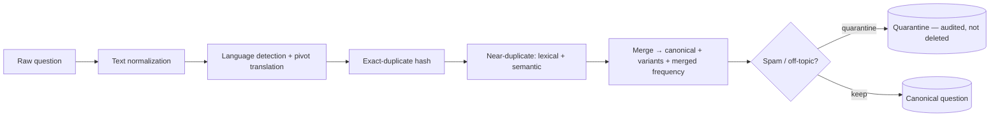
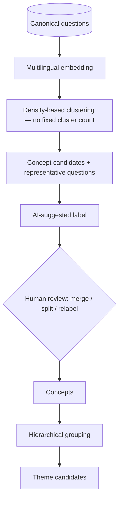
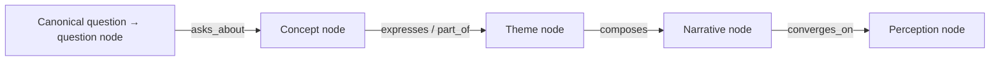
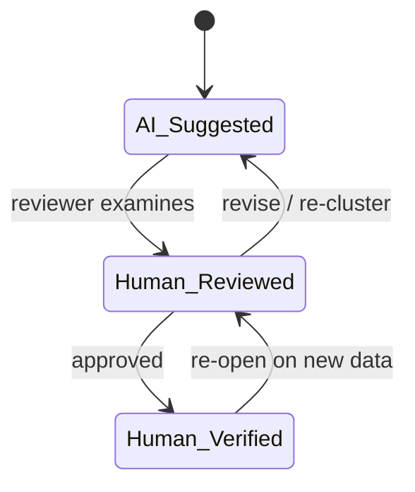
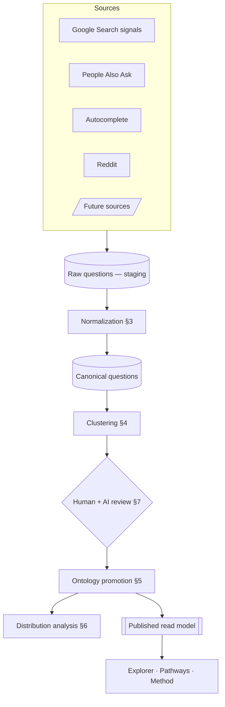

# Ask About Korea — Question Collection Framework

**Status:** Research design (pre-implementation) · **Version:** 1.0
**Companion to:** [`docs/ARCHITECTURE.md`](./ARCHITECTURE.md), [`lib/schema.ts`](../lib/schema.ts)

This document defines the methodology by which public questions about Korea are
collected, cleaned, clustered, and prepared as ontology data. It is a research
design; it specifies **no** connectors, APIs, or interface changes.

## Methodological premise

The unit of study is the **question**, not the topic. We do not begin from a
taxonomy of Korea (food, culture, history, and so on) and sort questions into it.
We begin from the questions people actually ask and allow structure — concepts,
themes, and ultimately perceptions — to **emerge** from them. This is a
bottom-up, grounded approach: categories are an *output* of analysis, never an
input.

Three commitments follow from this premise and govern every stage below:

1. **Emergence over classification.** No predefined categories. Clusters are
   discovered from data and named afterward, subject to review.
2. **Triangulation over any single source.** Each source is partial and biased;
   confidence comes from a question appearing across independent sources.
3. **Observation over judgment.** The framework records *what is asked* and *how
   it is asked*. Interpretation (themes, narratives, perceptions) is a separate,
   human-led, auditable step — never automated to conclusion.

---

## 1. Question Collection Framework — Sources

Four sources are used at launch. They are complementary: search-surface sources
provide breadth and scale but shallow context; community sources provide depth
and framing but demographic skew. No source is treated as representative on its
own.

### 1.1 Google Search (query signals)

| Dimension | Description |
|---|---|
| **Question type revealed** | Directed, explicitly phrased information needs ("why", "how", "is…"). The terse, canonical way a need is typed. |
| **User intent captured** | A person with a specific, formed question seeking an answer now. |
| **Limitations** | Raw query logs are not public; we observe search behavior indirectly through SERP features and third-party keyword datasets. This introduces sampling and vendor bias, English/commercial skew, and only relative (not exact) frequency. |
| **Contribution** | Establishes the baseline demand signal — which needs are common enough to surface at all. |

### 1.2 Google People Also Ask (PAA)

| Dimension | Description |
|---|---|
| **Question type revealed** | Algorithmically related *follow-up* questions that branch from a seed topic. |
| **User intent captured** | Exploratory intent — "having asked X, what do people ask next?" |
| **Limitations** | Curated by Google's relevance model, so it reflects that model's view of adjacency, not raw demand. It expands recursively, is largely English-centric, carries no volume, and changes over time. |
| **Contribution** | Reveals how a topic *branches*. Its adjacency structure is a strong prior for concept clustering (§4) and for question→question edges. |

### 1.3 Google Autocomplete

| Dimension | Description |
|---|---|
| **Question type revealed** | In-progress query formulations — the phrasings people begin to type, captured at the "leading edge" of curiosity. |
| **User intent captured** | Nascent, partially formed curiosity, and the exact language people use. |
| **Limitations** | Prefix- and seed-sensitive (results depend entirely on the stem queried), popularity- and recency-weighted, moderated/filtered by the provider, localized, and volume-free. It reflects a suggestion algorithm as much as pure demand. |
| **Contribution** | Surfaces authentic phrasings and emerging question stems; excellent for discovering the *shape* of questions to seed collection. |

### 1.4 Reddit

| Dimension | Description |
|---|---|
| **Question type revealed** | Unprompted, natural-language questions and the discussion around them, often from people with a real stake (travelers, learners, the diaspora, residents). |
| **User intent captured** | Lived, contextual curiosity — including the *why behind the why*, sentiment, and framing. |
| **Limitations** | Demographic skew (English-speaking, younger, Western-leaning communities), community-specific norms, noise, sarcasm, and non-representativeness. Requires moderation and context to interpret. |
| **Contribution** | Provides qualitative depth and framing that terse search phrasings lack; grounds concepts in how real people actually talk about Korea. |

### 1.5 Cross-source logic

A question's **evidentiary strength** rises with the number of independent
sources on which it appears. A phrasing seen only in autocomplete is a weak
signal; the same underlying question seen in autocomplete, PAA, and Reddit is a
robust one. Cross-source presence is recorded (§2) and used throughout analysis
(§6). Future sources (Naver, YouTube search, X, academic FAQ corpora) extend this
logic without changing it.

---

## 2. Question Collection Model

Every collected item is stored as a normalized record. Fields below map to
`Question` / `QuestionSource` / `RawQuestion` in [`lib/schema.ts`](../lib/schema.ts).

| Field | Description | Notes |
|---|---|---|
| **Question ID** | Stable identifier | slug or UUID |
| **Question Text** | The question, retained in its original language | localized `{ ko, en }` once translated |
| **Source** | Platform + specific source record | many sources per question (join) |
| **Collection Date** | When it was observed | per source, per window |
| **Language** | Detected language of the original | `ko` / `en` / … |
| **Country / Region** | Region of demand where inferable | often null; never fabricated |
| **Frequency Indicator** | *Relative*, normalized demand signal (0–1) | not a precise volume — sources do not permit that |
| **Raw Source Data** | Untouched payload as observed | audit + reproducibility |
| **Collection Method** | How it was gathered | e.g. autocomplete-seed-expansion, PAA-crawl, reddit-query, manual |
| **Status** | Position in the collection lifecycle | see below |

**Collection lifecycle (status):**

```
raw → normalized → deduplicated → clustered → promoted → (archived)
```

This lifecycle is the collection-stage view; it feeds the platform-wide
`question.status` (`new → mapped → observed → published`) defined in the data
architecture.

> The **Frequency Indicator is deliberately relative.** Because no source exposes
> true query volume, frequency is a normalized, cross-source composite used for
> ranking and emphasis — never presented as an absolute count.

---

## 3. Question Normalization Process

Normalization has one job: reduce the many surface forms of a question to a
smaller set of **canonical questions**, each carrying its variant phrasings and a
merged frequency. It is distinct from clustering (§4): normalization collapses
*paraphrases of one need*; clustering groups *different needs* into concepts.



**Stages:**

1. **Text normalization** — Unicode normalization, whitespace/punctuation
   standardization, casing, removal of tracking artifacts. The original raw text
   is always retained.
2. **Language normalization** — detect the source language; keep the original and
   attach a translation to a pivot language (English) *for comparison only*.
   Non-English questions are never discarded; translation exists so Korean and
   English questions about the same need can be compared and merged.
3. **Exact-duplicate detection** — hash of the normalized text; identical strings
   collapse immediately with frequency summed.
4. **Near-duplicate merging** — a two-signal test:
   - *lexical* (token overlap / edit distance) for small phrasing changes, and
   - *semantic* (embedding cosine similarity above a tuned threshold) for
     paraphrases that share few words.
   Matches merge into a **canonical question** with a `variants[]` list and
   combined frequency.
5. **Spam / off-topic filtering** — heuristics and an optional classifier remove
   non-questions, commercial solicitation, gibberish, policy-violating content,
   and items unrelated to Korea. Filtered items are **quarantined, not deleted**,
   so decisions remain auditable and reversible.

### Worked example

The three surface forms —

> "Why is Kimchi famous?" · "What makes Kimchi famous?" · "Why do people like Kimchi?"

— share few enough words that lexical matching alone is partial. Semantic
similarity, however, is high: all three express one underlying information need
("what accounts for kimchi's prominence"). They **merge into a single canonical
question** with three recorded variants and a combined frequency. That canonical
question later joins the *Kimchi / fermentation / Korean food* concept cluster in
§4 — but the merge (variants of one question) and the clustering (many questions
into one concept) are separate operations at separate levels.

---

## 4. Clustering Framework

Clustering groups **canonical questions** into **concept clusters**. Categories
are the emergent result; none are supplied in advance.



**Design choices:**

- **Multilingual embeddings** place Korean and English questions in one space, so
  the same need clusters regardless of language.
- **Density-based clustering** (e.g. HDBSCAN-style) is preferred over methods that
  require a predetermined number of clusters. This lets the number of concepts be
  discovered, and lets genuinely isolated questions remain unclustered rather than
  be forced into a group.
- **Soft / multi-membership.** A question may relate to more than one concept.
  Membership is expressed as weighted edges, not a hard partition, which is what
  allows *shared* concepts to appear.
- **Labeling.** Each cluster is described by its representative questions and
  extracted key terms, then given an AI-suggested label (§7) that a reviewer
  confirms, edits, merges, or splits.
- **Hierarchy.** Fine clusters are concepts; grouping concepts yields **theme
  candidates**, the coarse layer used in §5. Themes are thus also emergent.
- **Stability.** Clustering is re-run as data grows; cluster drift is monitored
  and coherence diagnostics are used as *diagnostics only* — human adjudication,
  not a metric, decides merges and splits.

**Worked examples (illustrative, emergent):**

- Questions about *kimchi*, *fermentation*, and *Korean food* fall into one
  dense region and become a single food-heritage concept cluster.
- Questions about *K-pop*, *learning Korean*, and *Korean cultural influence*
  each cluster separately, yet all link strongly to a **shared** *Soft Power*
  concept — a node with high inbound connectivity. That shared concept is exactly
  how the framework surfaces relationships *across* question groups rather than
  filing them into separate boxes.

---

## 5. Ontology Preparation Flow

Clustered questions are promoted into typed ontology nodes and edges. The
transition is deliberately staged from computational to interpretive:



| Transition | Nature | Who leads |
|---|---|---|
| Question → Concept | **computational** — clustering membership, weighted by similarity + frequency | AI-proposed, human-confirmed |
| Concept → Theme | **semi-automated** — hierarchical grouping + curation | shared |
| Theme → Narrative | **interpretive** — a synthesized statement of how a set of themes reads | human-led, AI-assisted |
| Narrative → Perception | **interpretive** — recurring narratives across many questions | human-led |

**Promotion rules:**

- A canonical question becomes a `question` node; its variants and sources become
  its `evidence`.
- A reviewed concept cluster becomes a `concept` node; membership becomes
  `question → concept` edges with weight.
- Concepts group into `theme` nodes; themes are synthesized into `narrative`
  nodes; recurring narratives cluster into `perception` nodes.
- Every node and edge carries a **review status** and **provenance** (§7), so the
  provisional and the verified are always distinguishable.

The interpretive transitions (theme → narrative → perception) are where research
judgment and neutrality matter most, and are precisely the transitions the
framework keeps human-led. This is a design safeguard for a public-diplomacy
context: the platform observes and organizes; it does not let a model
autonomously assert what Korea *is*.

---

## 6. Distribution Analysis Framework

Once questions are canonical and clustered, distribution analysis characterizes
the shape of public curiosity. It is analytical, not promotional: the aim is to
understand the information environment, including where it is thin.

**Research questions and the measures that answer them:**

| Research question | Measure |
|---|---|
| What dominates public curiosity? | concept/cluster **demand share** (normalized frequency) |
| What is underrepresented? | concepts with high demand but low **content coverage** (an *information gap*, from the content layer) |
| Which questions appear across platforms? | **cross-source breadth** (count of independent sources per question/concept) |
| Which concepts connect multiple clusters? | concept **centrality** (degree / betweenness in the ontology graph) |

**Visualizations (designed for future use; they feed the existing Explorer, not
a separate dashboard):**

- **Distribution charts** — ranked demand share across concepts (bar / treemap),
  showing the relative weight of curiosity.
- **Trend analysis** — concept frequency across collection windows (small-multiple
  lines) to detect rising, stable, and fading curiosity, and the *emergence* of
  new concepts.
- **Cluster maps** — a 2-D projection (e.g. UMAP) of the question embedding space,
  colored by cluster: a literal "map of curiosity" that shows density, adjacency,
  and outliers.
- **Ontology growth maps** — node and edge counts over time, tracking how the
  graph densifies, where new concepts attach, and how coverage evolves.

**Framing note:** an *information gap* is described as a research finding about the
environment ("this concept is widely asked about but thinly answered"), never as a
marketing or ranking opportunity.

---

## 7. Human + AI Review Framework

AI accelerates discovery; it does not conclude. Every AI action produces a
*candidate* that a person must advance. Three explicit states govern each node,
edge, cluster label, and narrative:



| State | Meaning | Who acts | Visibility |
|---|---|---|---|
| **AI Suggested** | Proposed by a model (cluster, label, edge, draft narrative) | AI | provisional; may be shown as clearly-marked draft |
| **Human Reviewed** | A researcher has examined and adjusted it | reviewer | interim |
| **Human Verified** | Approved as authoritative | reviewer/lead | the authoritative graph |

**Where AI assists, and where it stops:**

| Task | AI role | Human role |
|---|---|---|
| Question clustering | proposes clusters + memberships | merges / splits / confirms |
| Concept extraction | proposes labels + key terms | approves / rewrites labels |
| Theme generation | proposes groupings | curates theme boundaries |
| Narrative suggestion | drafts candidate statements | authors / verifies the final narrative |
| Perception | (not auto-generated) | human-led synthesis |

**Guardrails:**

- Every AI suggestion is logged with model, version, and date, and is reversible.
- Provenance (`ai_cluster` → `manual`) is retained even after verification, so the
  graph can be filtered by "AI-proposed vs. human-verified."
- Narratives and perceptions — the interpretive, reputationally sensitive layer —
  are **never** auto-published; they require human verification.
- Only `Human Verified` content is treated as authoritative in the public
  Explorer; provisional items, if shown at all, are labeled as such.

---

## 8. Future API Integration Plan

This framework is the methodology; the [data architecture](./ARCHITECTURE.md)
already defines the mechanism. Integration therefore requires **no redesign** —
only the implementation of the connector contract already specified
(`SourceConnector` in `lib/schema.ts`).

**End-to-end collection workflow (the framework in one view):**



**Phasing (aligned with the architecture's roadmap):**

1. **Phase A — manual seed.** Researchers hand-collect a seed set through the four
   sources, normalize and cluster by hand, and author the initial ontology. (This
   is today's sample data, produced by this method in miniature.)
2. **Phase B — assisted collection.** Semi-automated collection (seeded
   autocomplete/PAA expansion, Reddit queries) into the staging store; AI-assisted
   normalization and clustering with human verification.
3. **Phase C — connector integration.** Implement `SourceConnector`s for each
   platform. Because normalization is the single choke point and the website reads
   only the published read model, adding a connector changes nothing downstream.
4. **Phase D — continuous collection.** Scheduled runs, cross-source frequency
   compositing, trend and growth analysis over time.

**Why new sources never force a redesign:** a source contributes `RawQuestion[]`
and nothing else. Everything after normalization — dedup, clustering, ontology,
analysis, and the public site — is source-agnostic. Adding Naver, YouTube search,
or an academic FAQ corpus is one new connector plus, if needed, one new language
in the localized fields.

---

## Appendix · Relationship to existing documents

| This document defines | Realized by |
|---|---|
| What each source reveals (§1) | `Source`, `SourceConnector` (`lib/schema.ts`) |
| Collection record (§2) | `Question`, `QuestionSource`, `RawQuestion` |
| Normalization + dedup (§3) | normalization stage in the ingestion pipeline (`ARCHITECTURE.md` §4) |
| Emergent clustering (§4) | clustering job (`ARCHITECTURE.md` §5) |
| Ontology promotion (§5) | `node`, `edge`, provenance (`ARCHITECTURE.md` §3, §5) |
| Review states (§7) | `EdgeProvenance` + review status (`ARCHITECTURE.md` §5) |
| Read model to the site (§8) | `GraphReadModel` (`lib/schema.ts`), `buildGraph()` (`lib/ontology.ts`) |

The methodology and the architecture are two views of one system: this document
says *how questions become structure*; the architecture says *where that
structure lives and how it is served*.
